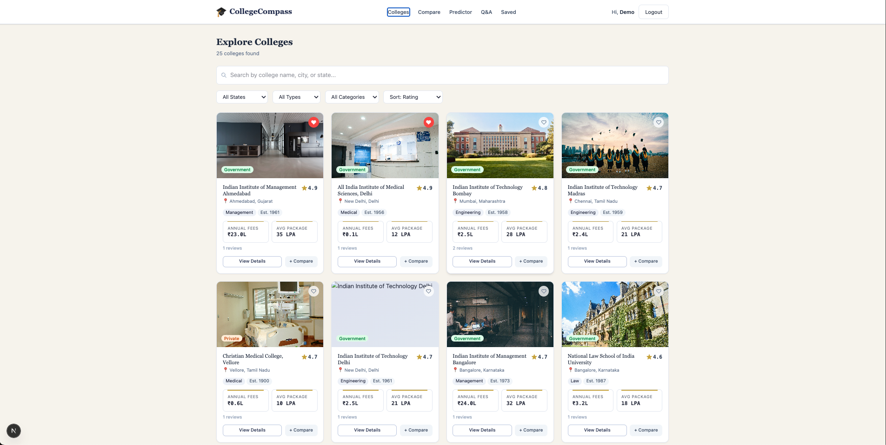
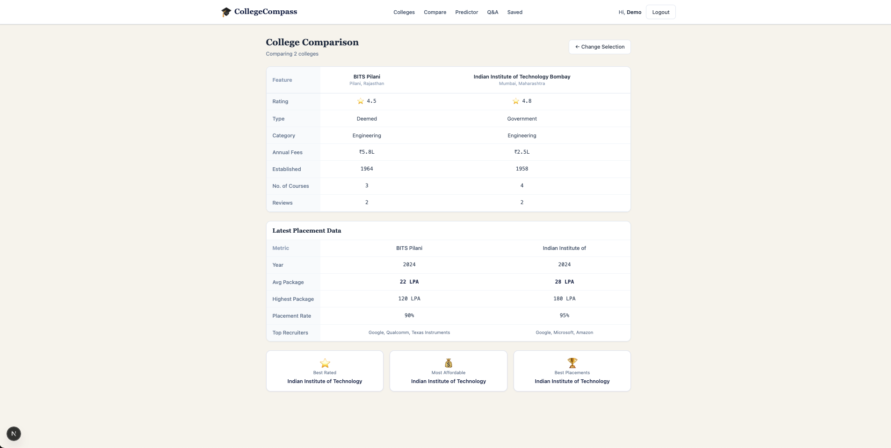
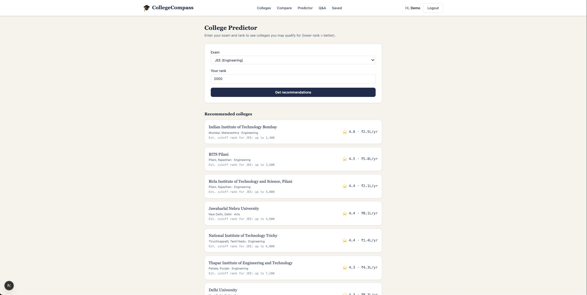
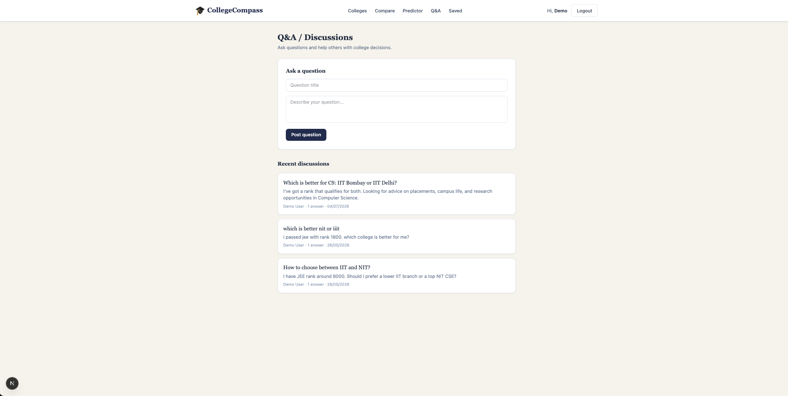

# College Discovery

A web app to help students discover colleges, compare options, predict admission chances, and get their college-related questions answered.

**Live Demo:** [https://college-discovery-mocha.vercel.app/](https://college-discovery-mocha.vercel.app/)

## Screenshots

| College | Compare |
|---|---|
|  |  |
 
| Predictor | Q&A |
|---|---|
|  |  |

## Tech Stack

- **Framework:** Next.js (App Router) + TypeScript
- **Database/ORM:** Prisma
- **Styling:** Tailwind CSS
- **Auth:** Custom auth (register/login/logout, session context)

## Features

- **Browse Colleges** — searchable/filterable list of colleges with detail pages
- **Compare** — compare multiple colleges side by side
- **Predictor** — predicts admission chances based on user input
- **Q&A / Discussions** — ask questions and get answers from other users
- **Save Colleges** — bookmark colleges to a personal saved list
- **User Accounts** — register, log in, and stay signed in across sessions

## Running Locally

```bash
git clone https://github.com/<your-username>/<repo-name>.git
cd <repo-name>
npm install
```

Copy `.env.example` to `.env` and fill in the required values (database connection string, auth secret, etc.):

```bash
cp .env.example .env
```

Set up the database:

```bash
npx prisma generate
npx prisma migrate dev
npx prisma db seed
```

Start the dev server:

```bash
npm run dev
```

Open [http://localhost:3000](http://localhost:3000).